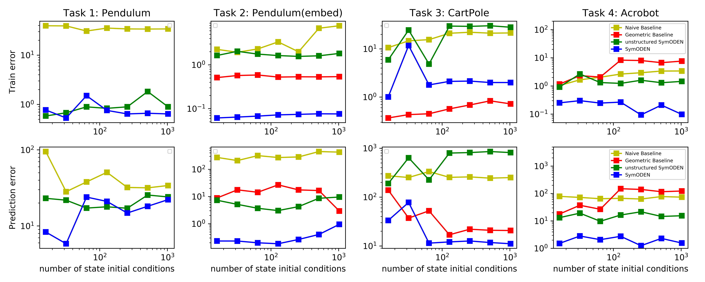
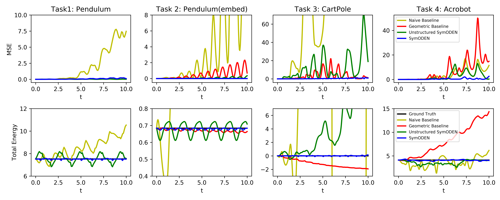
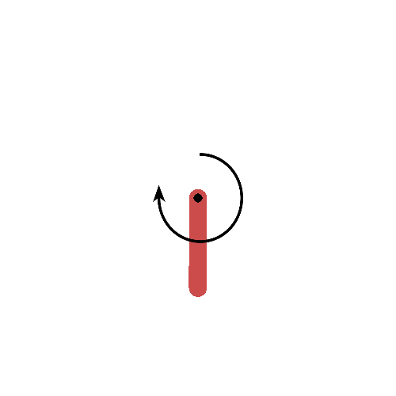
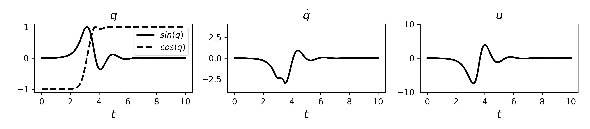
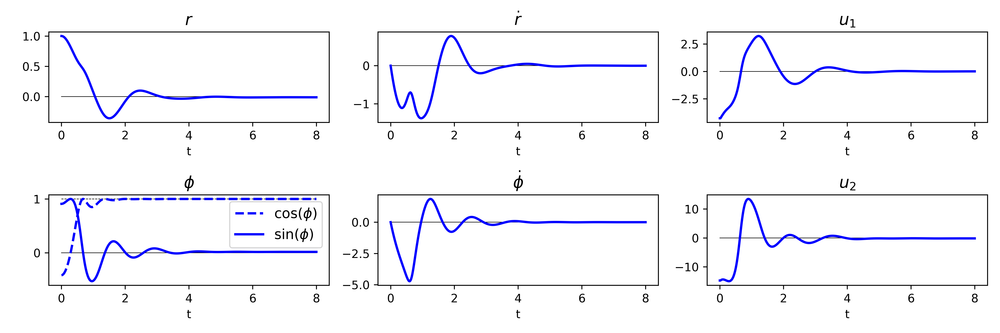
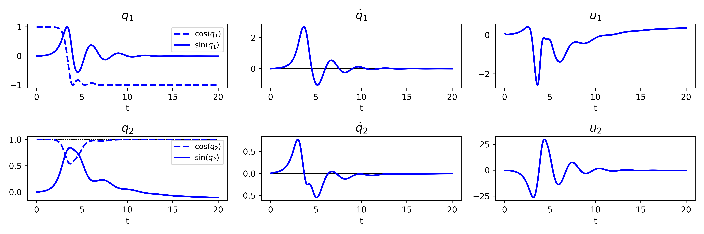

---

<div align="center">    
 
# Symplectic ODE-Net: Learning Hamiltonian Dynamics with Control

Yaofeng Desmond Zhong, Biswadip Dey, Amit Chakraborty | 2019

[](https://openreview.net/forum?id=ryxmb1rKDS)
[](https://arxiv.org/abs/1909.12077)

</div>

_TL;DR_: This work enforces Hamiltonian dynamics with control to learn system models from embedded position and velocity data, and exploits this physically-consistent dynamics to synthesize model-based control via energy shaping.
## Summary
Symplectic ODE-Net (SymODEN) is an end-to-end learning framework which can infer the dynamics of a physical system from observed state trajectories. To achieve better generalization with fewer training samples, SymODEN incorporates appropriate inductive bias by designing the associated computation graph in a physics-informed manner. In particular, we enforce Hamiltonian dynamics with control to learn the underlying dynamics in a transparent way which can then be leveraged to draw insight about relevant physical aspects of the system, such as mass and potential energy. In addition, we propose a parametrization which can enforce this Hamiltonian formalism even when the generalized coordinate data is embedded in a high-dimensional space or we can only access velocity data instead of generalized momentum. This framework, by offering interpretable, physically-consistent models for physical systems, opens up new possibilities for synthesizing model-based control strategies. 

## Performance

**_The variation in training error and prediction error with changes in the number of initial state conditions in the training set_.**  We can see that SymODEN yields better generalization in all the tasks.  In Task 3, although the Geometric Baseline Model beats the other ones in terms of training error,  SymODEN generates more accurate predictions,  indicating overfitting in the Geometric Baseline Model.  By incorporating the physics-based prior of Hamiltonian dynamics, SymODEN learns dynamics that obey physical law and thus performs better in prediction.  In most cases, SymODEN trained with less training data beats other models with more training data in terms of training error and prediction error, indicating that better generalization can be achieved with fewer training samples.


**_The evolution of MSE and the total energy along a trajectory with a previously unseen initial condition_.** For all the tasks, the MSE predicted by the baseline models diverges faster than the prediction from SymODEN. The Unstructured SymODEN works well in Task 1, Task 2 and Task 4 but not so well in Task 3.  As for the total energy, in the two pendulum tasks, SymODEN and Unstructured SymODEN conserve total energy by oscillating around a constant value. In these models, the Hamiltonian itself is learnt and the prediction of the future states stay around a level set of the Hamiltonian. Baseline models, however, fail to find the conservation and the estimation of future states drift away from the initial Hamiltonian level set.

## Energy-shaping Control Based on Learned Dynamics
**Task 2: Pendulum (embed):** We train the model using data generated by OpenAI Gym. We modify the action space to allow large actions and change the numerical scheme of the simulator to RK4. After learning the dynamics, an energy-based controller is designed to stabilize the pendulum at the inverted position. 




Here is the rendering of a trajectory and how the state variables and the action (control input) change with time. Black reference lines indicate the desired values in the end. 

--------------

**Task 5: Fully-actuated CartPole:** We train SymODEN on fully-actuated CartPole. We modify the action space to allow large control on both the position of the cart and the angle of the pendulum. As before, we change the numerical scheme of the simulator to RK4. With learnt dynamics, an energy-based controller is designed to stabilize the pendulum at the upright position and the cart at the center. 




Here is the rendering of a trajectory and how the state variables and the action (control input) change with time. Black reference lines indicate the desired values in the end. 

-------------

**Task 6: Fully-actuated Acrobot:** We train SymODEN on fully-actuated Acrobot. We modify the action space to allow large control on both angles and change the numerical scheme of the simulator to RK4. With the learnt dynamics, an energy-based controller is designed to stabilize the acrobot to the upright position.




Here is the rendering of a trajectory and how the state variables and the action (control input) change with time. Black reference lines indicate the desired values in the end. 

## Training
To train Symplectic ODE-Net(SymODEN):
- Task 1: Pendulum: `python experiment-single-force/train.py --verbose --structure`
- Task 2: Pendulum(embed): `python experiment-single-embed/train.py --verbose --structure`
- Task 3: CartPole: `python experiment-cartpole-embed/train.py --verbose --structure`
- Task 4: Acrobot: `python experiment-double-embed/train.py --verbose --structure`
- Task 5: Fully-actuated CartPole: `python experiment-fa-cartpole/train.py --verbose --structure`
- Task 6: Fully-actuated Acrobot: `python experiment-fa-acrobot/train.py --verbose --structure`

## Pre-trained models
The pre-trained models are stored and versioned in this repo using `git-lfs`. To download all the pretrained models, please install `git-lfs` according to its [official website](https://git-lfs.github.com/). 

First, initiate `git-lfs`
```bash
git lfs install
```
Then, clone the repository and you should be able to automatically get pretrained models downloaded.
```bash
git clone https://github.com/d-biswa/Symplectic-ODENet.git
cd Symplectic-ODENet
```

If, for whatever reason, you get some pointer files (script files) instead of pretrained models (binary files), you will observe the following
```bash
cd Symplectic-ODENet
cat experiment-single-embed/pend-baseline_ode-dopri5-p4.tar
#
# outputs something like:
# 
# version https://git-lfs.github.com/spec/v1
# oid sha256:0f229a56a7fe821fb1560414c3df055c7e8d92b1947452067c5cfe9c95bd71d2
# size 1827324
```

In this case, either the models are not downloaded or the models are downloaded but not haven't been checkouted yet. You can run the following commands to download models and make sure the pointer files can find the downloaded models.
```bash
git lfs fetch
git lfs checkout
```

(Optional) You can also download all the versioned models in the repo by running
```bash
git lfs fetch --all
git lfs checkout
```
It will download all the versioned models from the beginning of this project. The total size is ~1.2G.

You can then analyze the pre-trained models :
- Task 1: Pendulum: [analyze-single-force.ipynb](./analyze-single-force.ipynb)
- Task 2: Pendulum(embed): [analyze-single-embed.ipynb](./analyze-single-embed.ipynb)
- Task 3: CartPole: [analyze-cartpole-embed.ipynb](./analyze-cartpole-embed.ipynb)
- Task 4: Acrobot: [analyze-double-embed.ipynb](./analyze-double-embed.ipynb)
- Task 5: Fully-actuated CartPole: [analyze-fa-cartpole.ipynb](./analyze-fa-cartpole.ipynb)
- Task 6: Fully-actuated Acrobot: [analyze-fa-acrobot.ipynb](./analyze-fa-acrobot.ipynb)

Others results:
- Train loss and prediction loss with different number of state initial conditions: [analyze-train-pred-loss.ipynb](./analyze-train-pred-loss.ipynb)
- MSE along a single trajectory: [analyze-MSE.ipynb](./analyze-MSE.ipynb)
- Ablation study (SymODEN and HNN): [analyze-ablation-hnn.ipynb](./analyze-ablation-hnn.ipynb)
- Effects of time horizon : [analyze-effect-tau.ipynb](./analyze-effect-tau.ipynb)

## Dependencies
This project is written in Python 3.7 and tested with the following packages
- OpenAI Gym: 0.14.0
- PyTorch: 1.0.1
- Torchdiffeq: 0.0.1
- Numpy: 1.16.2
- Scipy: 1.2.1
- ImageIO: 2.4.1

## Acknowledgement
This research was inspired by the ideas and plans articulated by N. E. Leonard and A. Majumdar, Princeton University, in their ONR grant \#N00014-18-1-2873.  The research was primarily carried out during Y. D. Zhong's internship at Siemens Corporation, Corporate Technology. Pre- and post-internship, Y. D. Zhong's work was supported by ONR grant \#N00014-18-1-2873.