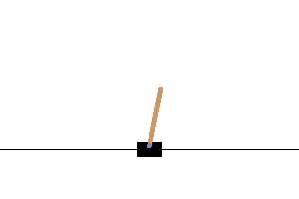
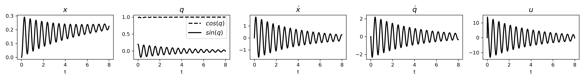

# Symplectic ODE-Net: Learning Hamiltonian Dynamics with Control
Yaofeng Desmond Zhong, Biswadip Dey, Amit Chakraborty | 2019

- Paper: [arxiv.org/abs/1909.12077](https://arxiv.org/abs/1909.12077)

## Basic Usage
To train Symplectic ODE-Net(SymODEN):
- Task 1: Pendulum: `python experiment-single-force/train.py --verbose --structure`
- Task 2: Pendulum(embed): `python experiment-single-embed/train.py --verbose --structure`
- Task 3: CartPole: `python experiment-cartpole-embed/train.py --verbose --structure`
- Task 4: Acrobot: `python experiment-double-embed/train.py --verbose --structure`

The trained models are stored in this repo using git-lfs. To analyze the models:
- Task 1: Pendulum: [analyze-single-force.ipynb](./analyze-single-force.ipynb)
- Task 2: Pendulum(embed): [analyze-single-embed.ipynb](./analyze-single-embed.ipynb)
- Task 3: CartPole: [analyze-cartpole-embed.ipynb](./analyze-cartpole-embed.ipynb)
- Task 4: Acrobot: [analyze-double-embed.ipynb](./analyze-double-embed.ipynb)

## Performance

**The variation in training error and prediction error with changes in the number of state initial conditions in the training set.**  We can see that SymODEN yields better generalization in all the tasks.  In Task 3, although the Geometric Baseline Model beats the other ones in terms of training error,  SymODEN generates more accurate predictions,  indicating overfitting in the Geometric Baseline Model.  By incorporating the physics-based prior of Hamiltonian dynamics, SymODEN learns dynamics that obey physical law and thus performs better in prediction.  In most cases, SymODEN trained with less training data beats other models with more training data in terms of training error and prediction error, indicating that better generalization can be achieved with fewer training samples.

## Summary
Symplectic ODE-Net (SymODEN) is a deep learning framework which can infer the dynamics of a physical system from observed state trajectories. To achieve better generalization with fewer training samples, SymODEN incorporates appropriate inductive bias by designing the associated computation graph in a physics-informed manner. In particular, we enforce Hamiltonian dynamics with control to learn the underlying dynamics in a transparent way which can then be leveraged to draw insight about relevant physical aspects of the system, such as mass and potential energy. In addition, we propose a parametrization which can enforce this Hamiltonian formalism even when the generalized coordinate data is embedded in a high-dimensional space or we can only access velocity data instead of generalized momentum. This framework, by offering interpretable, physically-consistent models for physical systems, opens up new possibilities for synthesizing model-based control strategies. 

**The MSE and the total energy evolves along a trajectory with a previously unseen initial condition.** For all the tasks, the MSE of the baseline models diverge faster than SymODEN. The Unstructured SymODEN works well in Task 1, Task 2 and Task 4 but not so well in Task 3.  As for the total energy, in the two pendulum tasks, SymODEN and Unstructured SymODEN conserve total energy by oscillating around a constant value. In these models, the Hamiltonian itself is learnt and the prediction of the future states stay around a level set of the Hamiltonian. Baseline models, however, fail to find the conservation and the estimation of future states drift away from the initial Hamiltonian level set.

## Control Based on Learnt Dynamics
In Task 2: Pendulum(embed), we train the model using data generated by OpenAI Gym. We modify the action space to allow large actions and change the numerical scheme of the simulator to RK4. After learning the dynamics, an energy-based controller is designed to control the pendulum to the inverted position. 

Here is the rendering of a trajectory and how the state variables and the action (control input) change with time.

-------------

In Task 3: CartPole, we train the model using data generated by OpenAI Gym. We modify the action space to a continuous one which allows large actions and change the numerical scheme of the simulator to RK4.The system is underactuated so we are not able to control the pole to the inverted position with arbitrary initial condition by using only potential energy shaping. However, if the initial position of the pole is around the inverted position, we are able to design a PD controller to prevent it from falling off. 

Here is the rendering of a trajectory and how the state variables and the action (control input) change with time.

## Dependencies
This project is written in Python 3.7 and tested with the following packages
- OpenAI Gym: 0.14.0
- PyTorch: 1.0.1
- Torchdiffeq: 0.0.1
- Numpy: 1.16.2
- Scipy: 1.2.1
- ImageIO: 2.4.1
