# Learning dyanmics using ODENet and HNN

Using ODENet would allow us to learn the dynamcis without using the "accelaration data". First we want to investigate what the results would be when HNN and ODENet are directly combined together. one technical detail along this line is that how to make a fair comparison. With the ODENet architecture, we can predict a series of data points forward in time given an initial condition. The most ideal comparison would be letting ODENet predicting one point ahead and comparing the predicted values and the true values. But the number of predicted points could be viewed as a parameter and we could investigate the quality of the results when this parameter changes. 

Todo: 
1. generate the results for different numbers of predicted points. Analyze the different performance in this context
2. try to enforce the **mass matrix** structure into the Hamiltonian.
3. try to enforce the **damping** structure into the Hamiltonian.
4. after these has been done. Implement the model to investigate the real pendulum data. 

## Hamiltonian dynamics of a pendulum 
$H(q, p) = \frac{l^2p^2}{2m} + 2mgl(1-cosq)$

$\dot{q} = \frac{\partial H}{\partial p}$

$\dot{p} = -\frac{\partial H}{\partial q}$

### The original result in the HNN paper, training set $(q, p, \dot{q}, \dot{p})$

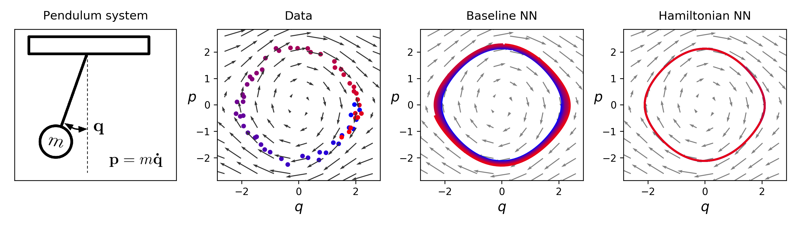
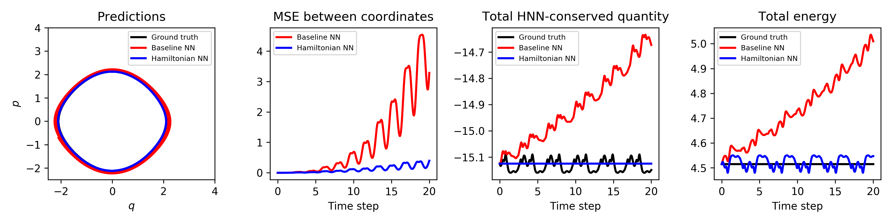

### Adding ODENet to HNN, training set $(q,p)$, evaluate 2 points

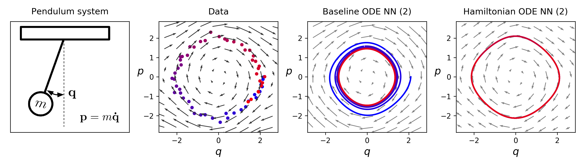
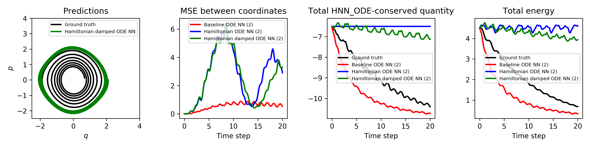

### Adding ODENet to HNN, training set $(q,p)$, evaluate 3 points

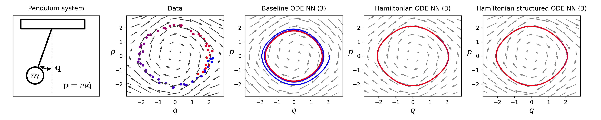
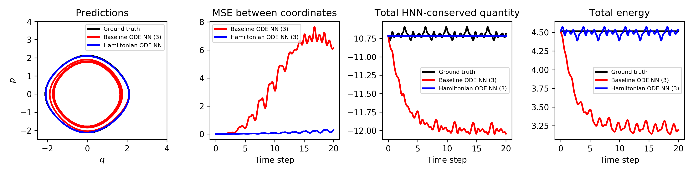

### Adding ODENet to HNN, training set $(q,p)$, evaluate 4 points

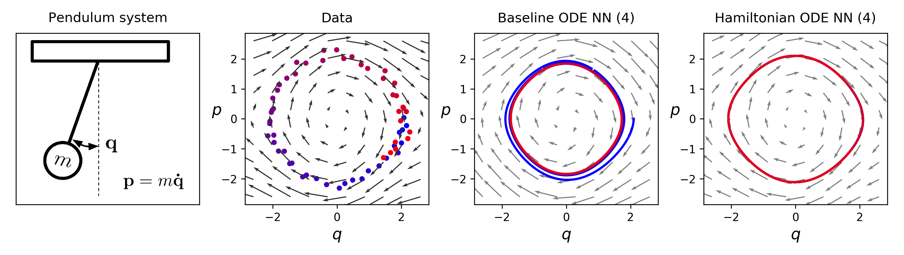
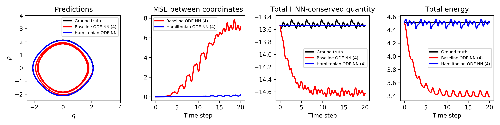

### Adding ODENet to HNN, training set $(q,p)$, evaluate 5 points

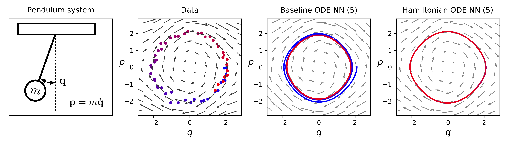
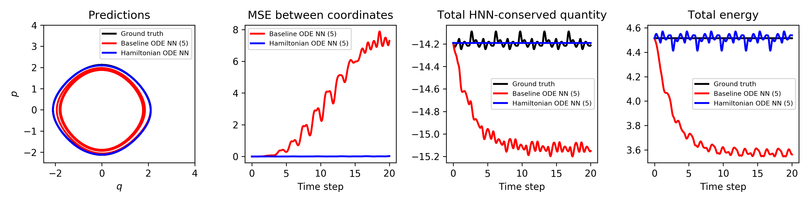

## Try to add structure to the ODENet

It takes some trial and error to figure out how to implement the mass matrix structure into the network, even in the 1D case
- First I parametrize the mass matrix as $M = L * L$. Since mass shows up in the denominator. in other words, mass inverse shows up. This scheme would cause issue in the traning procedure. My guess is that it's numerically unstable and some weights blow up
- Next I try to add a constant to the mass $ M = L * L + 0.1$. I think the positive constant stablized the process and the results are satisfatory.
- Biswa suggested learning the inverse of mass directly. so I tried $H = p * p * M_q /2 + V_q$ instead of $H = p * p / M_q /2 + V_q$, with $M = L * L$. Training looks correct but we actually learnt the wrong vector field.

## Add damping to the HNN
An inspection of the learnt Hamiltonian vector fieid reveals that the true Hamiltonian vector field is not learnt. The Hamiltonian structure ensure that there's no damping and the energy is conserved. But the dynamics suffers from a drift, which is faster than the true dynamics. 

By adding a damping term to the HNN, we allow the structured learning of damping. However, it seems that this approach suffers from some drawbacks. 
1. when feeding with energy conserved data, the damped HNN still learns a damping, which is a prior we enforce the system to do.
2. when feeding damped pendulum data, the damped HNN learns damping, but the performance is not greater than the baseline model. 
3. A potential advantage of using HNN is that we can interpret the result. However, since HNN is not learning the true hamiltonian field, it is not learning the true damping term as well. For example, in my experiment, we learnt a underdamped term for damping but the trajectory is a overdamped trajectory, which indicates the Hamiltonian vector field is not learnt correctly. By checking the value of the Hamiltonian field, we find that this is actually the case. 
4. the above claims are wrong.

With noise, feeding in energy-conseved pendulum data to damped HNN results in learning a nontrivial damping term. 
Without noise, feeding in energy-conserved pendulum data to a damped HNN results in a nearly zero damping. Thus the damped HNN learns energy conservation. However, the baseline model damps away. 
Without noise, feeding in damped pendulum data to a damped HNN results in a underdamped result, while baseline model learns overdamping. In general the baseline model learns faster, but the damped HNN gives us interpretability. 

### **training data with no noise, undamped, uniformly distributed**
600 epochs
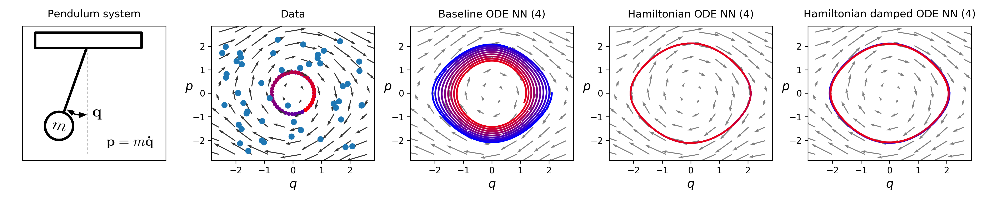
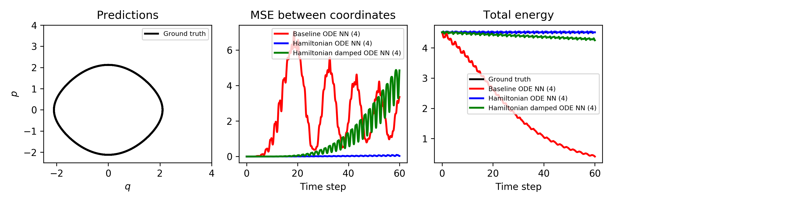

### **training data with no noise, damped, uniformly distributed**
1200 epochs
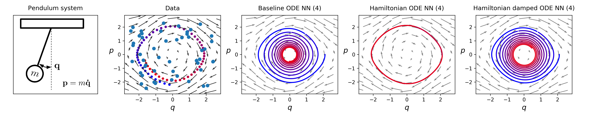
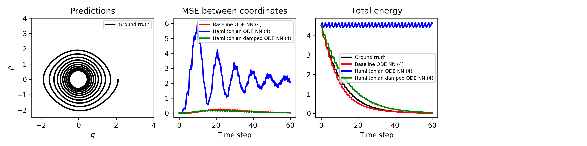

### **training data with noise, damped, distributed away from the origin**
600 epochs, noise std = 0.1, damping = 0.1
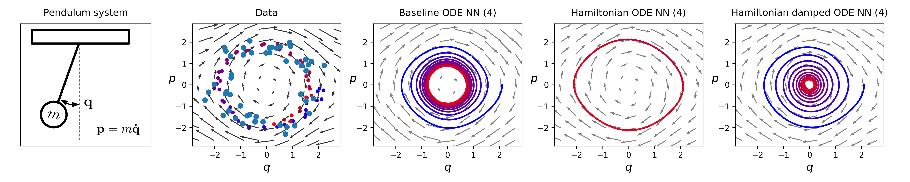
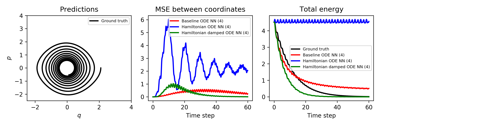

### **training data with noise, damped, uniformly distributed**
400 epochs, noise std = 0.1, damping = 0.1
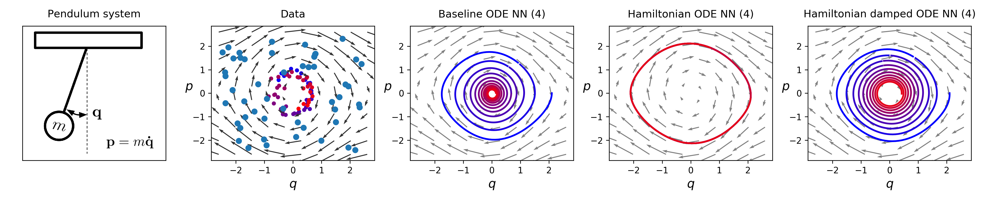
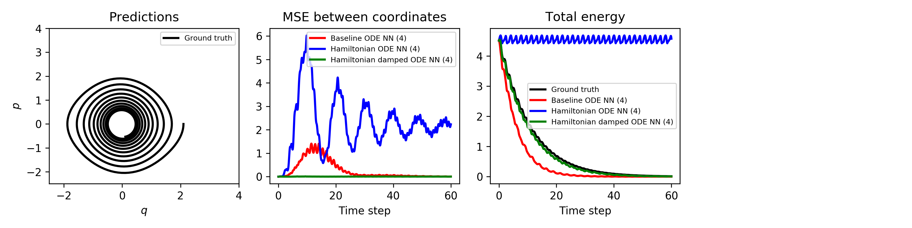

### **training data with noise, undamped, uniformly distributed**
600 epochs, noise std = 0.1
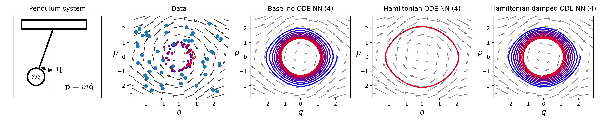
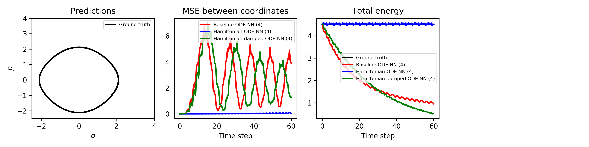
leanrt damping = 0.04
### **training data with noise, undamped, distributed away from the origin**
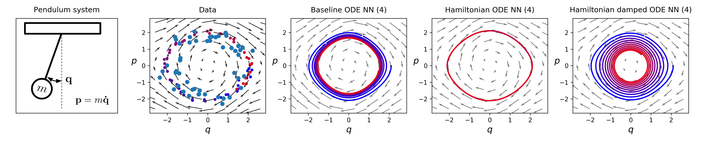
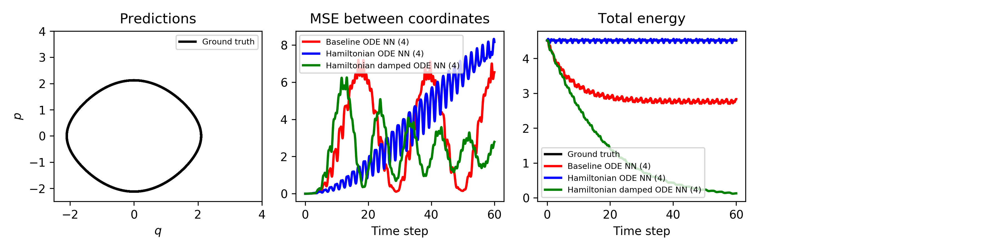
learnt damping = 0.06
when distributed away from the origin, the damped HNN learn noise as a damping term. The baseline model didn't see the data around the origin so it converges to a limit cycle. In the case, it seems that the baseline model is better, but this can be interpreted by the intrinsic properties of the models.

The above analysis is based on a state-independent damping matrix with three zero elements.
---

